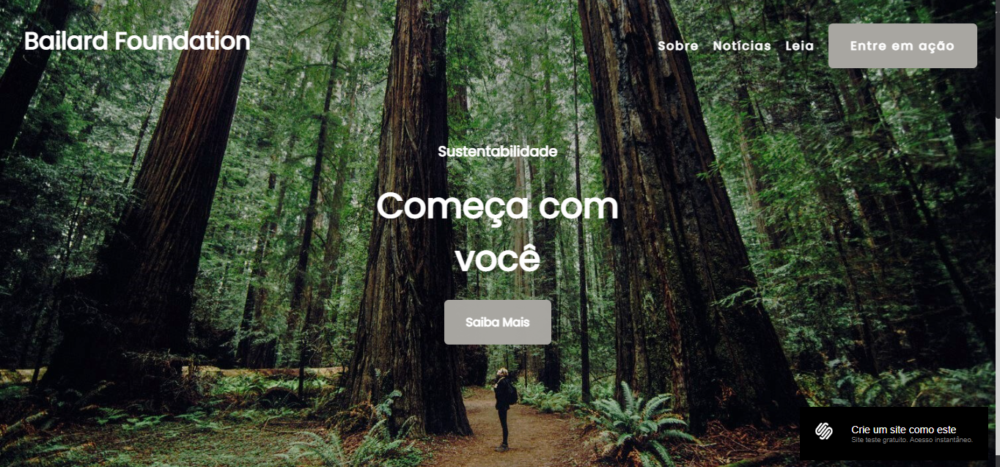

# **_Réplica do site Bailard Foundation_**

Bailard Foundation, trata-se sobre sustentabilidade, uma organização a favor desta causa.

Utilizando um template disponibilizado pela Squarespace (https://pt.squarespace.com/templates), **_decidi criar uma réplica, para colocar em prática minhas habilidades de Desenvolvimento Front-End_**, utilizando as tecnologias:

## **_Tecnologias_**

   HTML5 : Estruturação / marcação dos conteúdos.

   CSS: Estilização, tamanhos e aparência.

   JS: Interatividade e Efeitos.

**_Deploy: https://vitorsantos920.github.io/bailardFoundationReplica/_**

## **_Imagem do Projeto_**

